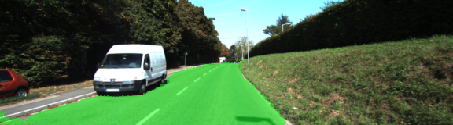
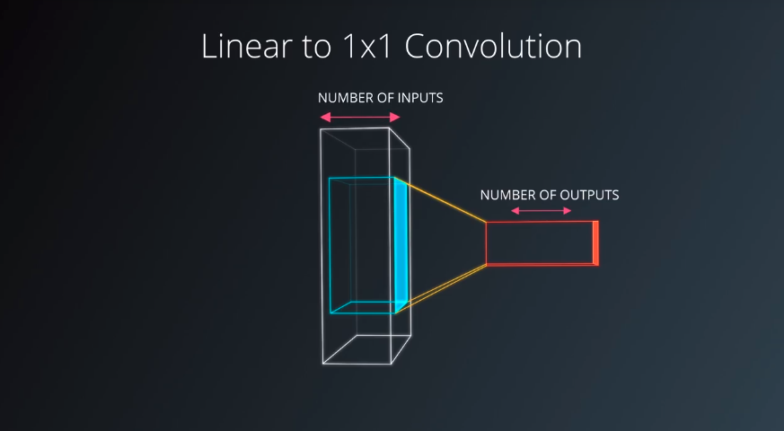
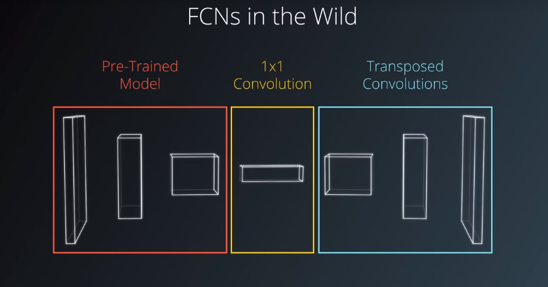

# Semantic Segmentation
### Udacity self-driving car nano degree

### Zheng lei


## 1.Introduction
In this project, you'll label the pixels of a road in images using a Fully Convolutional Network (FCN).

## 2. My enviroment
Graphic card: Nvidia Quadro M2000M, Memory 4G, 
Ubuntu16.4
python3.6 + cuda9.0 + tensorflow1.8

My Nvidia Quadro only have 4G memory, some times it is not enough to run the program. I need to exit the X server to save some memory.
`sudo service lightdm stop`

If you don't have enough memory, you could try Amazon AWS EC2 instance, the g3.4xlarge instance have 8G graphic memory.

## Data
Download the [Kitti Road dataset](http://www.cvlibs.net/datasets/kitti/eval_road.php) from [here](http://www.cvlibs.net/download.php?file=data_road.zip).  Extract the dataset in the `data` folder.  This will create the folder `data_road` with all the training a test images.

traning set
um_000000 - um_000094  total 95
umm_000000 - umm_000095  total 96
uu_000000 - uu_000097 total 98
total 289

test set
um_000000 - um_000095 total 96
umm_000000 - umm_000093 total 94
uu_000000 - uu_000099 total 100
total 300


## Size of image 
Additionally, since convolutional operations fundamentally don't care about the size of the input, 
a fully convolutional network will work on images of any size.

FCNs take advantage of three special techniques; one, replace fully connected layers with one by one convolutional layers, two,up-sampling through the use of transposed convolutional layers,three, skip connections. These skip connections allow the network to use information from multiple resolution scales.

Structurally an FCN is usually comprised of two parts; encoder and decoder.

## Program structure

------------------------------------
### help.py

- class DLProgress
  def hook
- maybe_download_pretrained_vgg
- gen_batch_function
- get_batches_fn
- gen_test_output
- save_inference_samples
  
-----------------------------------
### project_tests

- test_safe
  "isolate tests"
- func_wrapper
- _prevent_print
- _assert_tensor_shape  ???
- class TmpMock
  Mock a attribute. Restore attribute when exiting scope.
  def __init__
  def __enter__
  def __exit__
- test_load_vgg
- test_layers
- test_optimize
- test_train_nn
- test_for_kitti_dataset

### main.py

- load_vgg : Load Pretrained VGG Model into TensorFlow.
- conv_1x1
- upsample
- layers
- optimize
- train_nn
- run_tests()
- run()

### python package
os ： operating system interfaces
glob : Unix style pathname pattern expansion
unittest : Unit testing framework
from unittest import mock
unittest.mock : is a library for testing in Python


## Fully connected 1x1 Convolution
In this quiz you'll learn how to rewrite a dense layer, tf.layers.dense as a convolutional layer, tf.layers.conv2d. The underlying math will be the same, but the spatial information will be preserved allowing seamless use of future convolutional layers.



Let's use the first special technique in SCNs by replacing a fully connected layer with one by one convolutional layer. This will result in the output value with the tensor will remain 4D instead of flattening to 2D, so spatial information will be preserved. This may sound daunting but it's actually simpler than you might think.
At the core, we're still doing the same math as before. Recall, the output of the convolution operation is the result of sweeping the kernel over the input with the sliding window and performing element wise multiplication and summation. One way to think about this is the number of kernel is equivalent to the number of outputs in a fully connected layer.
Similarly, the number of weights in each kernel is equivalent to the number of inputs in the fully connected layer. Effectively, this turns convolutions into a matrix multiplication with spatial information.

## Transposed convolutions
Now, using the second special technique, we can create decoder of FCN's using transposed convolution. A transpose convolution is essentially a reverse convolution in which the forward and the backward passes are swapped. Hence, we call it transpose convolution.

Transposed convolutions are used to upsample the input and are a core part of the FCN architecture.

In TensorFlow, the API `tf.layers.conv2d_transpose` is used to create a transposed convolutional layer. 
tf.layers.conv2d_transpose(x,3,(2,2),(2,2))

- The second argument 3 is the number of kernels/output channels.
- The third argument is the kernel size,(2,2). Note that the kernel size could also be (1,1) and the output shape would be the same. However, if it were changed to (3, 3) note the shape would be (9,9), at least with 'VALID' padding
- The fourth argument, the number of strides, is how we get from a height and width from (4,4) to (8,8). If this were aregular convolution the output height and width would be (2,2).

## FCNs in practice
Let's take a few moments to talk about using FCNs in practice. An FCN has two components, the encoder and the decoder. We mentioned that encoder extracts features that will later be used by the decoder. This may sound familiar to transfer learning, and it is. In fact, we can borrow techniques from transfer learning to accelerate the training of our FCNs.
It's common for the encoder to be pre-trained on ImageNet VGG and ResNet are popular choices, as examples. 
By applying the first special technique of one by one convolutional layer conversion, we can complete the encoder portion of the FCN. The encoder is followed by the decoder, which uses a second special technique of transposed convolutional layers to upsample the image. Then the skip connection via the third special technique is added. 


Be careful not to add too many skip connections, though. It can lead to the explosion in the size of your model. For example, when using VGG-16 as the encoder, only the third and the fourth pooling layers are typically used for skip connections.


# Semantic Segmentation
### Introduction
In this project, you'll label the pixels of a road in images using a Fully Convolutional Network (FCN).

### Setup
##### GPU
`main.py` will check to make sure you are using GPU - if you don't have a GPU on your system, you can use AWS or another cloud computing platform.
##### Frameworks and Packages
Make sure you have the following is installed:
 - [Python 3](https://www.python.org/)
 - [TensorFlow](https://www.tensorflow.org/)
 - [NumPy](http://www.numpy.org/)
 - [SciPy](https://www.scipy.org/)
##### Dataset
Download the [Kitti Road dataset](http://www.cvlibs.net/datasets/kitti/eval_road.php) from [here](http://www.cvlibs.net/download.php?file=data_road.zip).  Extract the dataset in the `data` folder.  This will create the folder `data_road` with all the training a test images.

### Start
##### Implement
Implement the code in the `main.py` module indicated by the "TODO" comments.
The comments indicated with "OPTIONAL" tag are not required to complete.
##### Run
Run the following command to run the project:
```
python main.py
```
**Note** If running this in Jupyter Notebook system messages, such as those regarding test status, may appear in the terminal rather than the notebook.

### Submission
1. Ensure you've passed all the unit tests.
2. Ensure you pass all points on [the rubric](https://review.udacity.com/#!/rubrics/989/view).
3. Submit the following in a zip file.
 - `helper.py`
 - `main.py`
 - `project_tests.py`
 - Newest inference images from `runs` folder  (**all images from the most recent run**)
 
 ### Tips
- The link for the frozen `VGG16` model is hardcoded into `helper.py`.  The model can be found [here](https://s3-us-west-1.amazonaws.com/udacity-selfdrivingcar/vgg.zip)
- The model is not vanilla `VGG16`, but a fully convolutional version, which already contains the 1x1 convolutions to replace the fully connected layers. Please see this [forum post](https://discussions.udacity.com/t/here-is-some-advice-and-clarifications-about-the-semantic-segmentation-project/403100/8?u=subodh.malgonde) for more information.  A summary of additional points, follow. 
- The original FCN-8s was trained in stages. The authors later uploaded a version that was trained all at once to their GitHub repo.  The version in the GitHub repo has one important difference: The outputs of pooling layers 3 and 4 are scaled before they are fed into the 1x1 convolutions.  As a result, some students have found that the model learns much better with the scaling layers included. The model may not converge substantially faster, but may reach a higher IoU and accuracy. 
- When adding l2-regularization, setting a regularizer in the arguments of the `tf.layers` is not enough. Regularization loss terms must be manually added to your loss function. otherwise regularization is not implemented.
 
### Using GitHub and Creating Effective READMEs
If you are unfamiliar with GitHub , Udacity has a brief [GitHub tutorial](http://blog.udacity.com/2015/06/a-beginners-git-github-tutorial.html) to get you started. Udacity also provides a more detailed free [course on git and GitHub](https://www.udacity.com/course/how-to-use-git-and-github--ud775).

To learn about REAMDE files and Markdown, Udacity provides a free [course on READMEs](https://www.udacity.com/courses/ud777), as well. 

GitHub also provides a [tutorial](https://guides.github.com/features/mastering-markdown/) about creating Markdown files.
